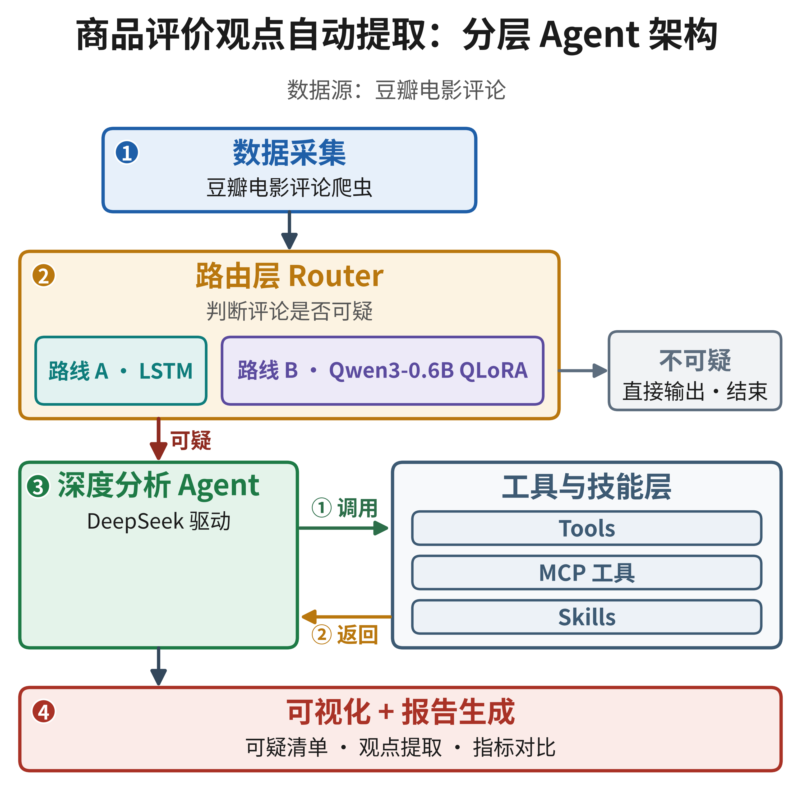
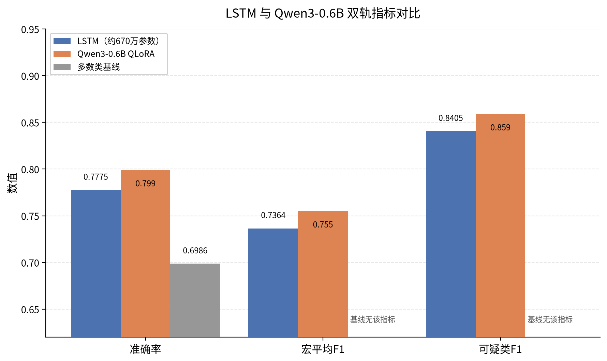
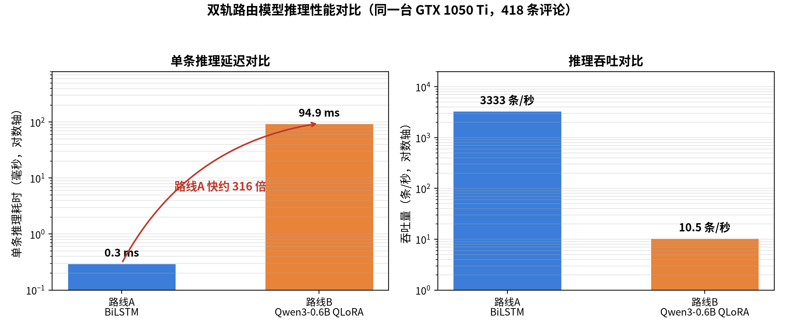
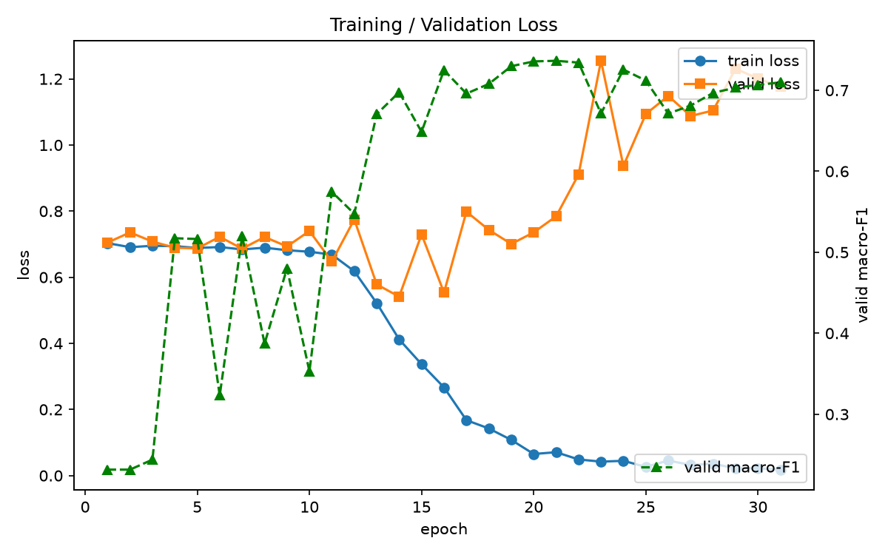
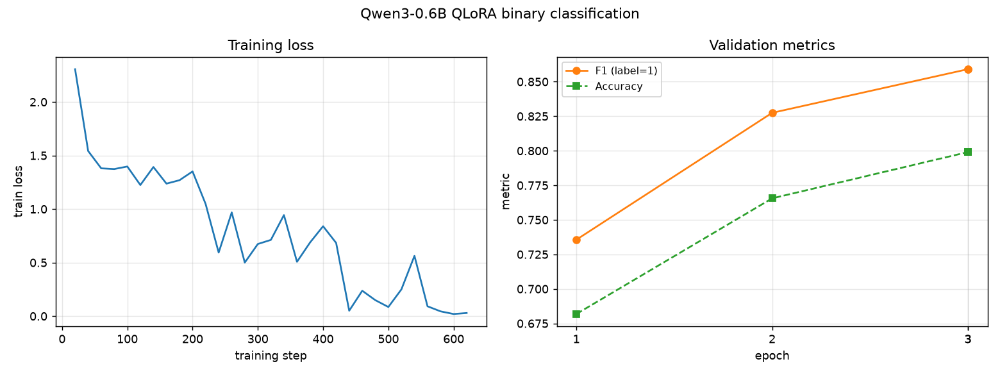
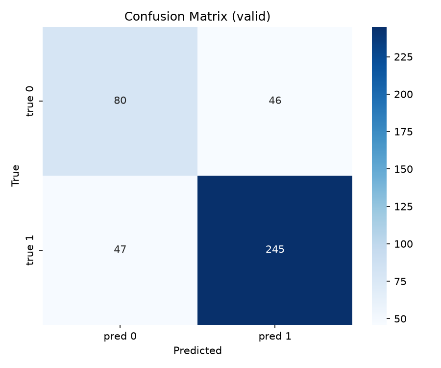

# 商品评价的观点自动提取 · douban-review-router

> 课题项目：把「每条评论都送大模型」的线性脚本，升级为 **System One 本地路由 + System Two 大模型深挖** 的分层 Agent 架构，并用 **同一任务、两条技术路线** 的对比实验证明「任务特性决定选型」。

本仓库为课题成果展示。所有密钥一律从环境变量读取，仓库内不含任何真实凭证。

---

## 一、课题简介

豆瓣商品/影视评论量巨大，但其中**只有少部分值得花大模型的钱去深挖**（水军刷分、反讽阴阳、极端情绪、引战拉踩、疑似 AI 生成）。原方案对每条评论都调用 DeepSeek 双角色精析，**贵、慢、且大部分算力浪费在普通评论上**。

本课题新增一个**评论路由层（Router）**做初筛：先判断「这条是否可疑、是否需要深挖」，只有命中的才送给 DeepSeek 深度分析。路由层自研（非调现成 API），对应 Agent 架构中 **System One（快速直觉）+ System Two（深度推理）** 的分工。

- **标签定义**：`1` = 可疑需深挖，`0` = 普通评论
- **数据来源**：豆瓣电影评论（移动端 rexxar API 爬取）+ DeepSeek 弱标签
- **最终产物**：双轨对比表（准确率 / 单条耗时 / 参数量 / 大模型调用节省率）+ 分层架构报告

---

## 二、整体架构

```
数据采集 (MCP 工具层：crawl_douban*.py + search_movie_info 查真实口碑)
        │
        ▼
┌─────────────────────────────────────────────┐
│  Router 层  (课题新增，二选一或并联对比)          │
│    ├─ 路线 A：LSTM 基线        ─┐               │
│    └─ 路线 B：Qwen3-0.6B 微调  ─┤               │
│        判断「是否可疑，需要深挖」                 │
└─────────────────────────────────────────────┘
        │  只分流可疑样本
        ▼
DeepSeek 深度分析 (Tools + MCP + Skills 三能力协同)
   ├─ Tools : 模型自主调用搜索（DeepSeek 服务端 web_search / Metaso）
   ├─ MCP   : search_movie_info 查豆瓣真实口碑 + run_python_code
   └─ Skills: 注入「影评分析专家」判定准则（反讽/水军识别/口碑对照）
        │
        ▼
可视化 + 报告
```



*图 1：分层 Agent 架构——先由路由层（System One）判断评论是否可疑，不可疑的直接输出结束，只有可疑样本才分流给 DeepSeek 深挖层（System Two），调用 Tools / MCP / Skills 三能力完成分析。*

### Agent 架构的三能力协同（本课题亮点）

主 agent（`src/agent/agent_chat.py`）把 **Tools / MCP / Skills** 三者串起来，
目标只有一个：模型在判断一条评论是否可疑时，能**先查这部电影的真实口碑**，再结合文本下结论。

| 能力 | 落点 | 作用 |
|---|---|---|
| **MCP** | `src/agent/mcp_server.py`（FastMCP stdio 服务） | ① `search_movie_info`：用豆瓣移动端 rexxar API 查片名/评分/评分人数，作为**外部真实口碑基准**；② `run_python_code`：模型可跑 Python 做数据处理 |
| **Tools** | `agent_chat.py` 的 function-tools | ① `deepseek_web_search`：DeepSeek **Responses API 服务端内置联网搜索**（`tools=[{"type":"web_search"}]`）；② `metaso_search`：秘塔 Metaso 第三方搜索兜底。模型自主决定何时调用 |
| **Skills** | `skills/movie_review_analyst.md` | 「影评分析专家」判定准则：反讽识别、水军识别、结合真实口碑判断、极端情绪/引战/AI 生成识别。**每次会话注入 system prompt** |

> 分工：MCP 提供**可执行工具**（含口碑查询），Tools 提供**模型自主决策的搜索能力**，
> Skills 提供**领域专家知识**。三者叠加让深度分析不再只靠模型裸猜。

---

## 三、目录结构

```
douban-review-router/
├── README.md
├── requirements.txt
├── .gitignore              # 密钥/原始数据/权重 全部排除
├── .env.example            # 环境变量模板（真正的 .env 被 gitignore）
├── src/
│   ├── config.py           # 统一路径 + 从环境变量构造 API client
│   ├── crawl/              # 爬虫
│   │   ├── crawl_douban.py
│   │   └── crawl_douban_phase3.py
│   ├── labeling/           # DeepSeek 弱标签
│   │   ├── label_deepseek.py
│   │   └── label_deepseek_phase3.py   # 6 条「可疑」判定标准
│   ├── data_prep/          # 数据合并 / 划分
│   │   ├── merge_comments.py
│   │   ├── merge_all.py
│   │   └── split_dataset.py
│   ├── router/             # 【双轨路由层】
│   │   ├── lstm_baseline.py    # 路线 A：LSTM 基线（真实训练脚本，已验证）
│   │   └── qwen_finetune.py    # 路线 B：Qwen3-0.6B QLoRA 微调（真实训练脚本，已验证）
│   └── agent/              # MCP 工具层 + 交互 agent（Tools/MCP/Skills 协同）
│       ├── mcp_server.py   # MCP server: run_python_code + search_movie_info(查豆瓣口碑)
│       └── agent_chat.py   # 主 agent 循环: MCP 工具 + DeepSeek/Metaso 搜索 + Skill 注入
├── skills/
│   └── movie_review_analyst.md   # 「影评分析专家」领域知识，注入 system prompt
├── data/
│   ├── raw/                # 爬取原始 csv（含用户名）→ gitignored
│   ├── interim/            # 合并/打标中间产物 → gitignored
│   └── desensitized/       # 仅 text,label，无 PII → 入库
│       ├── labeled_full.csv
│       ├── train.csv
│       └── valid.csv
└── docs/
    └── architecture_plan.md   # 完整升级方案
```

---

## 四、使用方法

### 1. 环境准备

```bash
python -m venv .venv && source .venv/bin/activate
pip install -r requirements.txt
```

> **Pascal 显卡注意**：GTX 1050 Ti 是 sm_61，PyTorch 需装 CUDA 12.x 兼容版（2.4~2.6），不要装最新版。

### 2. 配置密钥（重要）

复制模板并填入自己的 key，**不要把 key 写进代码**：

```bash
cp .env.example .env
# 编辑 .env，填入 DEEPSEEK_API_KEY=sk-xxxx
set -a && source .env && set +a     # 或 export DEEPSEEK_API_KEY=...
```

代码中所有密钥一律 `os.environ.get("DEEPSEEK_API_KEY")`。

### 3. 数据处理流水线

```bash
python src/crawl/crawl_douban.py          # 爬取 → data/raw/new_crawled/
python src/data_prep/merge_comments.py    # 合并去重 → data/interim/all_comments_merged.csv
python src/labeling/label_deepseek_phase3.py   # DeepSeek 弱标签 → data/interim/labeled_full.csv
python src/data_prep/split_dataset.py     # 8:2 分层划分 → data/desensitized/{train,valid}.csv
```

### 4. 训练双轨路由

```bash
# 需预置 data/desensitized/{train,valid}.csv 与 fastText 中文词向量
python src/router/lstm_baseline.py        # 路线 A：LSTM 基线（jieba 分词 + 预训练词向量 + BiLSTM）
python src/router/qwen_finetune.py        # 路线 B：Qwen3-0.6B QLoRA 微调（4bit，FP32，Pascal 兼容）
```

### 5. 运行 Agent（Tools + MCP + Skills）

```bash
# 需要 DEEPSEEK_API_KEY；联网搜索兜底可另设 METASO_API_KEY
python src/agent/agent_chat.py
```

启动后 agent 会：
1. 拉起 MCP server（`mcp_server.py`），获得 `run_python_code` 与 `search_movie_info`；
2. 注入 `skills/movie_review_analyst.md`（「影评分析专家」判定准则）到 system prompt；
3. 把 MCP 工具与 `deepseek_web_search` / `metaso_search` 合并成一份 tools 列表交给模型自主调用。

问它一句「判断这条评论是否可疑：XX 就是神作，毫无缺点」，它会先查该片真实口碑，再结合文本给出判断。

---

## 五、双轨对比说明（核心实验）

同一份数据集、同一个二分类任务，跑两条技术路线：

| | 路线 A：LSTM 基线 | 路线 B：Qwen3-0.6B 微调 |
|---|---|---|
| 定位 | System One 快速决策 | System Two 深度判断 |
| 参数量 | 极小（几十万级） | 0.6B（QLoRA 4bit） |
| 训练速度 | 秒级~分钟级 | 分钟级 |
| 推理速度 | 极快 | 较快 |
| 成本 | 接近零 | 低 |
| 精度 | 基线水平 | 更高 |
| 依赖 | torch + jieba + gensim | torch + transformers + peft + bitsandbytes |
| 输出初始化 | 预训练中文词向量（gensim） | Qwen3 预训练权重 |

**实测结果（远程 WSL2 训练，脱敏数据集 train/valid）**：

| 指标 | 路线 A：LSTM 基线 | 路线 B：Qwen3-0.6B QLoRA |
|---|---|---|
| 准确率 (acc) | 0.7775 | **0.799** |
| F1-macro | 0.7364 | **0.755** |



*图 2：两条路线的指标对比（Y 轴自 0 起）——Qwen3-0.6B QLoRA 在准确率、宏平均 F1、可疑类 F1 三项上均略高于 LSTM 基线；灰色为多数类基线（仅准确率）。*



*图 3：同一台 GTX 1050 Ti、418 条评论下的推理性能对比——LSTM 单条 0.3ms（约 3333 条/秒），Qwen3-0.6B 单条 94.9ms（约 10.5 条/秒），LSTM 快约 316 倍。*

**产出对比表**：准确率 / 单条推理耗时 / 参数量 / 大模型调用节省率。

**叙事落点（克制、用数据说话）**：分析任务特性后发现这是**轻量短文本分类**，无需一律堆大模型；对比证明在保证精度的前提下，轻量 RNN 能覆盖大部分场景，大模型微调只在极端样本上体现优势。**任务特性决定选型。**

关于 tokenizer 的说明：**RNN 路线不需要 transformer tokenizer**，用 jieba 分词 + 词索引即可；路线 B 才用 Qwen tokenizer。

### 训练曲线与混淆矩阵



*图 4：LSTM 训练曲线——第 21 轮取得最优（accuracy 0.7775 / 宏平均 F1 0.7364），之后验证损失回升，呈现过拟合。*



*图 5：Qwen3-0.6B QLoRA 微调曲线——训练损失持续下降，验证准确率与可疑类 F1 稳步上升，3 轮内未见明显过拟合。*



*图 6：LSTM 在验证集上的混淆矩阵——可疑类 F1 0.8405 明显优于普通类 0.632，模型更擅长抓出可疑评论。*

---

## 六、凭证与密钥管理（硬规矩）

本项目的所有密钥一律不得进仓库，规矩如下：

1. **所有密钥从环境变量读取**：`os.environ.get("DEEPSEEK_API_KEY")`，不允许任何形式的硬编码。
2. **`.gitignore` 排除**：`.env`、`*.key`、`*secret*`、含密钥的 `config`、模型权重（`*.pt/*.safetensors/*.bin`）、原始/中间 CSV。
3. **数据脱敏**：仅 `text,label` 两列的脱敏数据入库；含 `用户` 列的原始爬取数据排除在仓库外。
4. **提交前必扫**：
   ```bash
   git grep -iE 'sk-|api[_-]?key|secret|token|winston|access_token'
   ```
   确认无真实密钥残留后再 push。
5. **任何含真实 key 的文件一律不进仓库**；如需保留，删除后重写为环境变量引用。

---

## 七、后续计划（Roadmap）

- [x] 仓库结构、防泄漏规范、README
- [x] 爬虫 / 弱标签 / 数据划分 脚本整理入库
- [x] WSL2 环境搭建（torch Pascal 兼容版 + transformers/peft）
- [x] 路线 A：LSTM 基线训练出结果（acc 0.7775 / F1 0.7364）
- [x] 路线 B：Qwen3-0.6B QLoRA 微调出结果（acc 0.799 / F1 0.755）
- [x] **Agent 架构升级：Tools + MCP + Skills 三能力协同**（查电影口碑、模型自主搜索、专家知识注入）
- [ ] 双轨对比表 + loss 曲线 + 报告定稿
- [ ] Router 接入 MCP agent 框架，统计大模型调用节省率

详细方案见 [`docs/architecture_plan.md`](docs/architecture_plan.md)。
